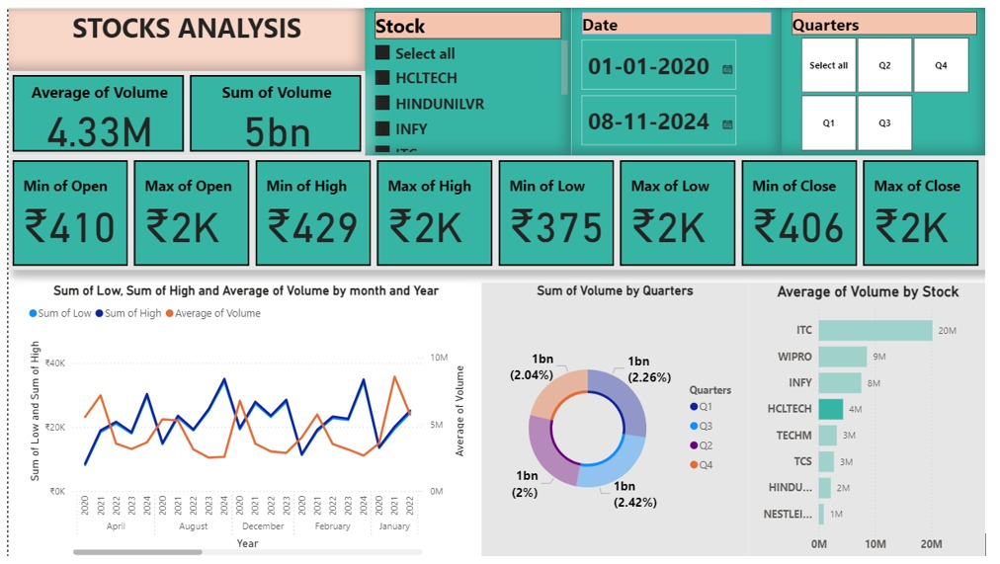

# Store Analytics Dashboard (Power BI)

# Objective:
This task aims to create a comprehensive, insightful, and visually appealing dashboard using the provided SuperStoreUS-2015 dataset. The dashboard will assess key performance indicators (KPIs) and present meaningful insights in a clear, actionable format.

# Analysis Conducted (Questions):

📈 Display sales, profit, and the percentage of returned orders.

📊 Compare month-wise sales.

🏆 Determine the most profitable and most loss-making products.

🌎 Identify the location where the highest profits are generated.

🧩 Analyze sales by customer segment.

🛒 Show the sales by product category.

💰 Show the profit gained in each region.

📊 Analyze the profit and sales by customer segment.

🏷️ Determine the sales by product sub-category.

# Solution:

# Data Cleaning:The following tasks were performed during data cleaning:

🗑️ Removed unwanted columns from the orders table to reduce unnecessary data.

🔍 Dropped the users table as it was not required for the analysis.

✂️ Removed the status column from the returns table since the status information was irrelevant to the analysis.

# Data Modeling:In this phase, the following steps were taken:

🔗 Created a relationship between the orders table and the returns table using the Order ID column.

📅 Created a Date table, essential for time-based analysis. Power BI requires a dedicated date table for optimal performance; without it, Power BI automatically generates multiple date tables in the backend, affecting performance.

🔄 Established a relationship between the orders table and the Date table using the date columns.

📐 Created a Measure table to store KPIs like Profit, Sales, and the percentage of returned orders. This helps to manage and maintain all the calculated measures in one place.

# Creating Visualizations:

KPIs (Cards):Total Sales, Profit, and Percentage of Returned Orders were displayed using card visuals, providing a quick glance at the overall performance.

Month-wise Sales Comparison (Line Chart):A line chart was created to compare month-wise sales, which revealed that:

📉 March 2015 had the lowest sales.

📈 April 2015 had the highest sales.

Profit by Product (Bar Chart):A bar chart was used to show profit by product. The analysis indicated:

💼 Binders and Binder Accessories were the most profitable products across all states.

Profit by Location (Map Chart):A map chart was created to show profits by state, revealing that:

🌞 California had the highest profit.

🌧️ North Carolina had the lowest profit.

Sales by Customer Segment (Donut Chart):A donut chart was used to analyze sales by customer segments, and it was found that:

🏪 The Small Business segment had the lowest sales.

Sales and Profit by Product Category (Clustered Column Chart):A Clustered Column Chart was used to analyze sales and profit by product category, providing information about the highest- and lowest-generating product categories in terms of sales and profit.

Profit and Sales by Region (Clustered Column Chart):A Clustered Column Chart was used to analyze sales and profit by each region, giving information about the highest and lowest sales and profit-generating regions.

Sales by Product Sub-category (Treemap Chart):A Treemap Chart was created to show the sales by product sub-category. The analysis shows that:

🖨️ Office Machines has the highest sales.

🏷️ Rubber Band has the lowest sales.

Profit by Customer Segment (Pie Chart):A Pie Chart was created to show the Profit by Customer segment:

💸 Small Business has the highest profit.

🏠 Consumer has the lowest profit.

Sales by Customer Segment (Pie Chart):A Pie Chart was created to show the Sales by Customer segment:

🏢 Corporate segment has the highest sales.

🏪 Small Business has the lowest sales.

# Filters (Slicers):
Created four slicers to allow users to interactively filter the data based on different fields such as date, product category, state, and customer segment.

# Color Coding in Visuals:

🔵 Dark blue was used to denote the highest values (e.g., highest sales, highest profit).

⚪ Grey was used to denote the lowest values (e.g., lowest sales, lowest profit).

# Dashboard Screenshot:
# 

# Conclusion:
The Super Store Analytics Dashboard provides a comprehensive overview of key performance indicators (KPIs) for the SuperStoreUS-2015 dataset, offering valuable insights into sales, profit, and customer behavior. By cleaning, modeling, and visualizing the data, the dashboard allows for easy exploration and in-depth analysis. Key findings, such as the highest and lowest sales, profitable and loss-making products, and performance across customer segments and regions, are presented through intuitive visualizations.
With interactive filters and consistent color coding, users can effortlessly navigate and customize their view of the data. The dashboard equips stakeholders with actionable insights to make informed decisions, optimize product performance, and strategically target regions and customer segments for improved profitability and growth. This project demonstrates the power of Power BI in transforming raw data into meaningful, actionable intelligence for business decision-making.

